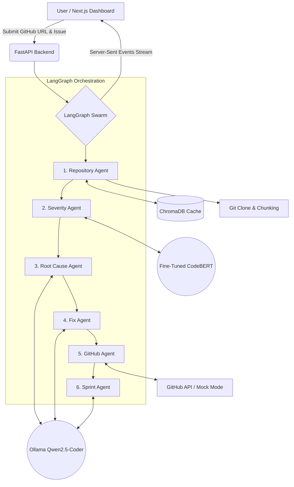

# BugInsight Swarm 🐝

**Microsoft Build AI 2026 Hackathon Submission**
**Theme:** AI-Powered Production Function

BugInsight Swarm is an autonomous, multi-agent AI system designed to eliminate the engineering bottleneck of triaging and fixing repository-wide bugs. By ingesting a GitHub issue, BugInsight dynamically clones the repository, semantically indexes its contents, predicts the severity of the bug, isolates the root cause, and generates a PR-ready patch—all orchestrated through a real-time event stream.

---

## 🏗️ Architecture

BugInsight leverages a 6-agent LangGraph workflow backed by specialized models.



### The Swarm Agents
1. **Repository Agent:** Performs a `git clone`, chunks source code, and semantically indexes the entire repository into ChromaDB. Built with a high-performance **Repository Cache** that reduces repeat analysis from minutes to milliseconds.
2. **Severity Agent:** Interfaces with a custom-trained **CodeBERT** model to predict the critical severity (P0-P4) of the issue.
3. **Root Cause Agent:** Uses **Qwen2.5-Coder** via local Ollama to ingest the semantic search context and deduce the exact file and lines causing the bug.
4. **Fix Agent:** Generates a targeted, PR-ready `git diff` patch.
5. **GitHub Agent:** Opens an actual Pull Request via the GitHub API (or operates in mock mode).
6. **Sprint Agent:** Calculates estimated developer time saved and assigns Agile story points.

## 🚀 Key Features

* **Dynamic Repository Indexing:** Point BugInsight at *any* public repository. It clones it on the fly and builds a semantic understanding of the codebase.
* **Intelligent Caching:** Hashing algorithms ensure that once a repository is cloned and embedded into ChromaDB, subsequent analyses are near-instantaneous.
* **Real-time SSE Dashboard:** A sleek Next.js frontend built with React Strict Mode safety to stream agent completions, patch generation, and CodeBERT predictions in real-time.
* **100% Local Inferencing Capability:** Capable of running entirely on local hardware (Ollama + local PyTorch models) for maximum security and privacy.

## 💻 Tech Stack

* **Frontend:** Next.js (App Router), React, Tailwind CSS
* **Backend:** FastAPI, Server-Sent Events (SSE), Uvicorn
* **Orchestration:** LangGraph
* **AI/ML:** PyTorch, HuggingFace (CodeBERT), Ollama (Qwen2.5-Coder:7b)
* **Vector Store:** ChromaDB (SentenceTransformers)

## 🏁 Getting Started

### Prerequisites
* Python 3.10+
* Node.js 18+
* Ollama installed and running (`qwen2.5-coder:7b` pulled)

### 1. Start the Backend
```bash
# Start Ollama (if not already running as a service)
ollama serve

# Install python dependencies
pip install -r requirements.txt

# Start the FastAPI server
python -m uvicorn swarm.api:app --host 0.0.0.0 --port 8000
```

### 2. Start the Frontend
```bash
cd frontend
npm install
npm run dev
```

Navigate to `http://localhost:3000` to launch the Swarm.

---
*Built with ❤️ for Microsoft Build AI 2026*
